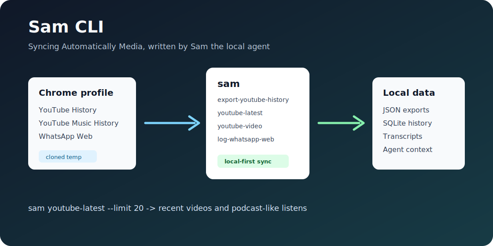
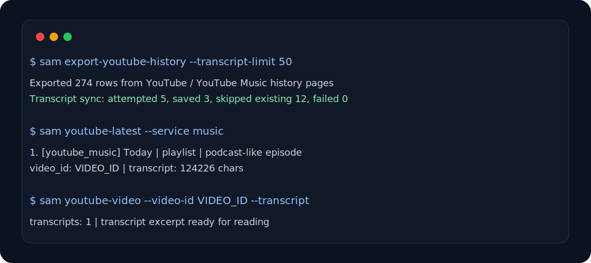

# Sam CLI

**Sam CLI** is a local-first command-line tool for turning personal media activity into queryable data.

The name is both personal and practical: Sam is the agent who wrote the tool, and **SAM** is a loose backronym for **Syncing Automatically Media**. It syncs YouTube, YouTube Music, transcripts, and WhatsApp Web snapshots into local files and SQLite databases so an agent, script, or human can inspect them later.



## What It Does

- Exports the real YouTube History and YouTube Music History pages from a logged-in Chrome profile.
- Fetches YouTube transcripts automatically for long-form videos.
- Skips Shorts by default when reading watch history.
- Skips normal YouTube Music songs and only treats long Music items as podcast-like transcript candidates.
- Resolves podcast-like YouTube Music rows through regular YouTube search when Music does not expose a video ID.
- Reads the latest watched videos/podcasts from SQLite without reopening the browser.
- Prints deeper metadata and transcript excerpts for a specific video.
- Exports visible WhatsApp Web chats/messages from a cloned Chrome profile.
- Stores raw JSON plus normalized SQLite tables.

## Install

Sam CLI runs on Bun and currently expects Google Chrome on macOS for browser automation.

```bash
git clone https://github.com/yoav0gal/sam-cli.git
cd sam-cli
bun install
bun link
sam --help
```

You can also run it without linking:

```bash
bun run src/cli.ts --help
```

## Configure Chrome Profiles

Sam CLI clones a Chrome profile into a temporary directory before opening YouTube or WhatsApp. This keeps the real profile safer and lets the scraper use an already logged-in browser session.

By default it uses Chrome's `Default` profile. For a different profile, use flags:

```bash
sam export-youtube-history \
  --chrome-profile-dir "$HOME/Library/Application Support/Google/Chrome/Profile 1" \
  --profile-label Personal \
  --profile-email you@example.com
```

For repeated use, copy the example private config:

```bash
cp .samrc.example.json .samrc.json
```

Then edit `.samrc.json`:

```json
{
  "defaultProfile": "personal",
  "profiles": {
    "personal": {
      "label": "Personal",
      "email": "you@example.com",
      "dir": "~/Library/Application Support/Google/Chrome/Profile 1"
    }
  }
}
```

`.samrc.json`, `data/`, `exports/`, and `logs/` are ignored by git because they contain private account and history data.

## Common Commands



Sync YouTube and YouTube Music:

```bash
sam export-youtube-history
```

Read latest long-form videos and podcast-like listens:

```bash
sam youtube-latest
sam youtube-latest --limit 20
sam youtube-latest --service music
sam youtube-latest --json
```

Inspect one video and transcript:

```bash
sam youtube-video --video-id VIDEO_ID
sam youtube-video --video-id VIDEO_ID --transcript
sam youtube-video --video-id VIDEO_ID --transcript --transcript-chars 12000
```

Fetch or add transcripts manually:

```bash
sam fetch-youtube-transcript --video-id VIDEO_ID --language en
sam add-youtube-transcript --video-id VIDEO_ID --file transcript.txt --language en
```

Read WhatsApp Web:

```bash
sam export-whatsapp-web --list-chats
sam export-whatsapp-web --chat "Mom"
sam log-whatsapp-web --chats 20 --messages 5
```

Show the local database schema:

```bash
sam show-data-shape
```

## YouTube Transcript Rules

Automatic transcript fetching happens during `sam export-youtube-history` unless you pass `--no-transcripts`.

- Regular YouTube `watch` rows are eligible.
- YouTube Shorts are skipped.
- YouTube Music songs are skipped.
- YouTube Music rows are transcript candidates only when their scraped duration is at least 10 minutes.
- If a long Music row has no `video_id`, Sam CLI searches regular YouTube and prefers a long duration match.
- Existing transcripts are not fetched again.

Useful flags:

```bash
sam export-youtube-history --transcript-limit 50
sam export-youtube-history --transcript-language en
sam export-youtube-history --no-transcripts
```

Transcript fetching uses `@egoist/youtube-transcript-plus`, an unofficial free YouTube transcript library. It only works when YouTube exposes captions/transcripts and may need maintenance if YouTube changes internals.

## Data Model

Sam CLI writes private local data by default:

- YouTube DB: `data/youtube-history.sqlite`
- WhatsApp DB: `data/whatsapp-history.sqlite`
- Raw exports: `exports/`
- WhatsApp append-only log: `logs/whatsapp-web-conversation-log.jsonl`

The SQLite layer keeps repeated watch rows separate from video-level enrichment. Transcripts and summaries attach to `youtube_videos.video_id` instead of being duplicated on every history item.

## Privacy

This is not a cloud service. It is designed to run locally against your own logged-in browser profile. Do not commit `.samrc.json`, SQLite databases, raw exports, WhatsApp logs, or transcripts unless you intentionally want to publish that data.

## Agent Maintenance

Future agents working on this project should read [docs/SAM_CLI.md](docs/SAM_CLI.md) before changing behavior. When commands, flags, schema, transcript behavior, or scraper behavior change, update that doc in the same turn.

This repo also includes an installable Agent Skill:

```bash
npx skills add https://github.com/yoav0gal/sam-cli --skill sam-cli
```

The skill lives at [skills/sam-cli/SKILL.md](skills/sam-cli/SKILL.md) and tells future agents how to use and maintain Sam CLI without leaking private local data.

## Status

This is early, personal automation software. YouTube and WhatsApp Web are UI-driven surfaces, so selectors and transcript internals can change. The code favors transparent local storage and small verifiable commands over a hosted service.
